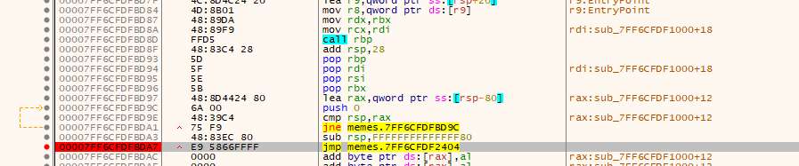
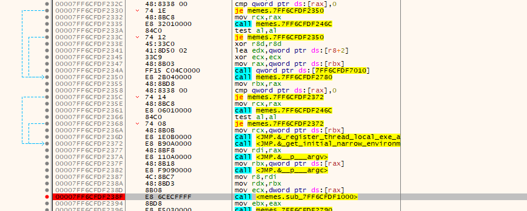
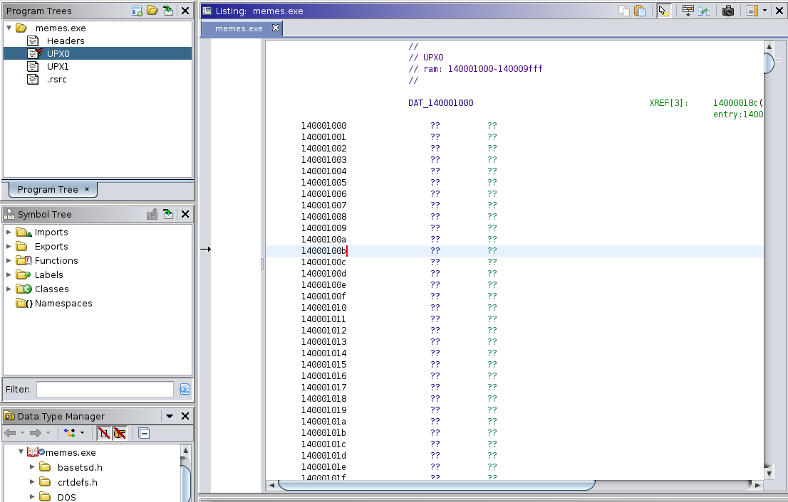

# Generic Flag Checker

This is everyone's favorite type of rev -- windows rev, where the hardest part is actually finding the code. Portable Executables are very annoying.

With that out of the way, let's actually get to the challange. Running `memes.exe` on the command line gives `bad input`, so we try adding an argument. If we run `memes.exe test`, we get `checking...`, but nothing else outputs, which is odd. However, putting a `flag{}` wrapper tells us our input is wrong:

```
C:\>memes.exe flag{test}
checking...
Incorrect!
```

So this does indeed look like a generic flag checker program. Let's start reversing now.

Unfortunately, advanced static analysis techniques (aka loading the exe into ghidra and randomly clicking on functions and addresses) do not reveal the where the actual flag checking part of the code is. The only code that ghidra finds is some sort of windows wrapper that appears to set up various memory protections and other dynamic linking-y stuff. It will probably be easier to debug a live program and follow the instruction pointer with [x64dbg](https://x64dbg.com/).

After opening up `memes.exe`, we first want to go into `File > Change Command Line` so the program run with a dummy flag as an argument. Now, the hunt for the flag checking code begins. The first call that we need to **Step Into** is at the bottom of the first block of `memes` related jumps and calls. We can confirm this by setting a breakpoint, **Step Over** and noting that the flag checking output is printed to the console.



Inside this first call we follow a jump and see some `argv` and `argc` related calls, so we know we're on the right track. Trial and error will tell that the call to `memes.sub` is where the checking happens, so we **Step Into** that call as well.



At this point, the instruction pointer has arrived right at to the beginning of the `"UPX0"` section of the exe. We can actually load up this section in ghidra (or a static analyzer of your choice) and the contents will be undefined. (We suspect this has something to do with the fact that [PEs do not contain position independent code](https://en.wikipedia.org/wiki/Portable_Executable#Relocations) and thus the code must be patched and loaded at runtime, although we're not entirely sure)



Inside this block, we see some familiar `std::cout` and other `C++` calls, so we know we've found the flag checking code. We can find a loop (with `edi/eax` as the counter) that appears to process the inputted flag in some way. This loop takes the flag string (with the `flag{}` wrapper already stripped) at `rbp-0x40` and copies each byte `c` at index `i` to `rbp-0x20` at index `i` the value `c-i`:

```
[note that ASLR will cause the addresses to be shifted]

7FF6CFDF11DE | xor edi,edi                         | Loop initialization
7FF6CFDF11E0 | lea rbx,qword ptr ss:[rbp-20]       |
7FF6CFDF11E4 | lea rsi,qword ptr ss:[rbp-40]       |
7FF6CFDF11E8 | jmp memes.7FF6CFDF11FC              |
7FF6CFDF11EA | nop word ptr ds:[rax+rax],ax        | --- LOOP INCREMENT ---
7FF6CFDF11F0 | mov byte ptr ds:[rdx+rax],r9b       | Write to string at rbp-0x20
7FF6CFDF11F4 | mov byte ptr ds:[rdx+rax+1],0       |
7FF6CFDF11F9 | add edi,1                           | Increment counter
7FF6CFDF11FC | mov eax,edi                         | --- LOOP BEGINS ---
7FF6CFDF11FE | cmp qword ptr ss:[rbp-10],rax       |
7FF6CFDF1202 | jbe memes.7FF6CFDF1252              |
7FF6CFDF1204 | cmp qword ptr ss:[rbp-8],F          |
7FF6CFDF1209 | mov rcx,rbx                         | 
7FF6CFDF120C | jbe memes.7FF6CFDF1212              |
7FF6CFDF120E | mov rcx,qword ptr ss:[rbp-20]       |
7FF6CFDF1212 | movzx r9d,byte ptr ds:[rcx+rax]     | Get the ith character of input
7FF6CFDF1217 | sub r9b,dil                         | Subtract i
7FF6CFDF121A | mov rax,qword ptr ss:[rbp-30]       |
7FF6CFDF121E | mov rcx,qword ptr ss:[rbp-28]       |
7FF6CFDF1222 | cmp rax,rcx                         |
7FF6CFDF1225 | jae memes.7FF6CFDF1240              | Break condition
7FF6CFDF1227 | lea rdx,qword ptr ds:[rax+1]        |
7FF6CFDF122B | mov qword ptr ss:[rbp-30],rdx       |
7FF6CFDF122F | mov rdx,rsi                         | 
7FF6CFDF1232 | cmp rcx,F                           |
7FF6CFDF1236 | jbe memes.7FF6CFDF11F0              |
7FF6CFDF1238 | mov rdx,qword ptr ss:[rbp-40]       |
7FF6CFDF123C | jmp memes.7FF6CFDF11F0              |
7FF6CFDF123E | nop                                 | --- LOOP ENDS ---
7FF6CFDF1240 | mov edx,1                           |
7FF6CFDF1245 | mov rcx,rsi                         |
7FF6CFDF1248 | call memes.7FF6CFDF1D80             |
7FF6CFDF124D | add edi,1                           |
7FF6CFDF1250 | jmp memes.7FF6CFDF11FC              |
7FF6CFDF1252 | movups xmmword ptr ss:[rbp-50],xmm6 |
7FF6CFDF1256 | mov byte ptr ss:[rbp-60],0          |
7FF6CFDF125A | xor edi,edi                         |
7FF6CFDF125C | lea rbx,qword ptr ds:[7FF6CFDF3000] | Load some 
7FF6CFDF1263 | lea rsi,qword ptr ss:[rbp-60]       |
7FF6CFDF1267 | cmp edi,9                           | Check that counter was 9
7FF6CFDF126A | jb memes.7FF6CFDF1281               |
```

At the end, it also checks that the counter was 9 (so we assume the length of the stripped flag is 9), and loads the address `7FF6CFDF3000` into `rbx`. Checking this address yields a secret buffer of sorts containing what looks like 9 ASCII bytes (as DWORDS):

```
7FF6CFDF3000 | 00000063
7FF6CFDF3004 | 0000006f
7FF6CFDF3008 | 0000006e
7FF6CFDF300c | 0000004c
7FF6CFDF3010 | 00000069
7FF6CFDF3014 | 00000060
7FF6CFDF3018 | 00000067
7FF6CFDF301c | 0000005e
7FF6CFDF3000 | 0000006b
```

Unfortunately, `63 6f 6e 4c 69 60 67 5e 6b` decodes to gibberish: `conLi``g^k`. However, we might guess that this secret buffer is being compared to the modified string produced by the above loop (`rbp-0x20`) with each index subtracted out. (If you want, you can read the code below to confirm this). So, we add `0 1 2 3 4 5 6 7 8` to the secret buffer values and get `63 70 70 5f 6d 65 6d 65 73`, which decodes to ASCII `cpp_memes`. Aha! We can confirm this is the flag by running `memes.exe flag{cpp_memes}` and getting `Correct!`.

> `flag{cpp_memes}`